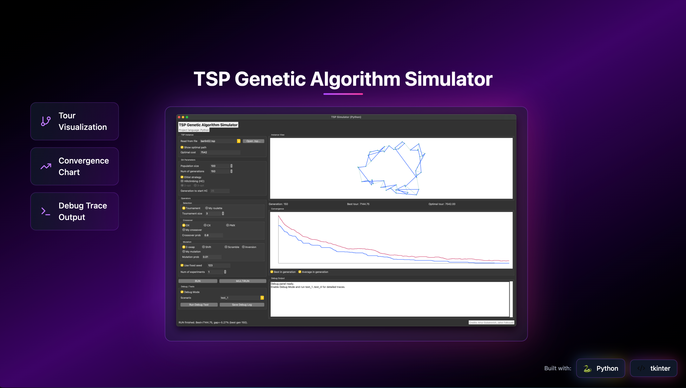

# TSP Genetic Algorithm Simulator

<p align="center">
  
</p>

A desktop GUI application for solving the **Travelling Salesman Problem (TSP)** using a configurable **Genetic Algorithm (GA)**. Built with Python and Tkinter.

## Features

- **TSP Instance Loading**:
  - Select from bundled instance names (`berlin52`, `eil51`, `kroA100`, `ch130`)
  - Open external `.tsp` files from GUI (`Open .tsp...`)
  - If local files are missing, bundled names are resolved to deterministic synthetic coordinates (for offline demos)
- **Configurable GA Parameters**:
  - Population size and number of generations
  - Elitist strategy toggle
  - Optional Hill Climbing (2-opt / 3-opt) with configurable start generation
- **Selection Operators**: Tournament, Custom Roulette
- **Crossover Operators**: OX (Order), CX (Cycle), PMX (Partially Mapped), Custom
- **Mutation Operators**: 2-swap, Shift, Scramble, Inversion, Custom
- **Visualization**:
  - Real-time instance map with city nodes and tour edges
  - Convergence chart tracking best and average tour length per generation
- **Experiment Support** — Run single or batch experiments with optional seed control
- **Debug/Test Mode (based on course hints)**:
  - `test_1` — Real/Binary value conversion trace
  - `test_2` — Tournament selection correctness trace
  - `test_3` — Parent selection by `p_cross` + crossover trace
  - `test_4` — Mutation trace for a chosen individual
  - Save debug output to `.txt` directly from GUI

## Requirements

- Python 3.10+
- Tkinter (included with most Python distributions)

## Installation

```bash
git clone https://github.com/Ar1Mi/TSP-SYM.git
cd TSP-SYM
```

### macOS (Homebrew Python)

If you encounter `ModuleNotFoundError: No module named '_tkinter'`, install the Tkinter package:

```bash
brew install python-tk@3.14
```

## Usage

```bash
python3 app.py
```

The simulator window will open with a control panel on the left and visualization area on the right.

### Run Automated Tests

```bash
python3 -m unittest discover -s tests -v
```

## Project Structure

```
.
├── app.py                 # Main GUI application
├── debug_scenarios.py     # test_1..test_4 debug scenario runners
├── tsp_ga.py              # GA operators and helper primitives
├── tsp_solver.py          # Full GA pipeline + TSPLIB loader + bundled instance resolver
├── tests/
│   ├── test_debug_scenarios.py
│   ├── test_tsp_ga.py
│   └── test_tsp_solver.py
└── README.md
```

## Architecture

The application follows a single-class MVC-like architecture:

- **`TSPSimulatorUI`** — Manages the entire GUI layout, state variables, and event wiring
- **Controls Panel** — Left sidebar with parameter inputs organized into logical groups
- **Visual Panel** — Right area with the instance map canvas and convergence chart
- **Debug Panel** — Scenario selector + verbose trace output + log export
- **Footer** — Status bar and credits

## Next Steps

- [ ] Add CSV/JSON export for multirun statistics
- [ ] Add optional cancellation/pause for long runs
- [ ] Support more TSPLIB edge-weight types beyond `EUC_2D` / `CEIL_2D`
- [ ] Add CLI mode for running experiments without GUI

## Authors

- **Artur Gubanovich**
- **Jahor Falkouski**

## License

This project is developed as part of the MIO (Metaheuristics and Intelligent Optimization) course.
